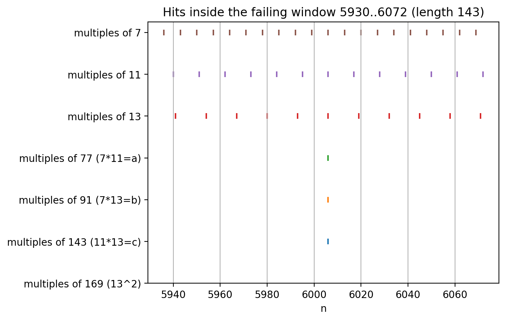
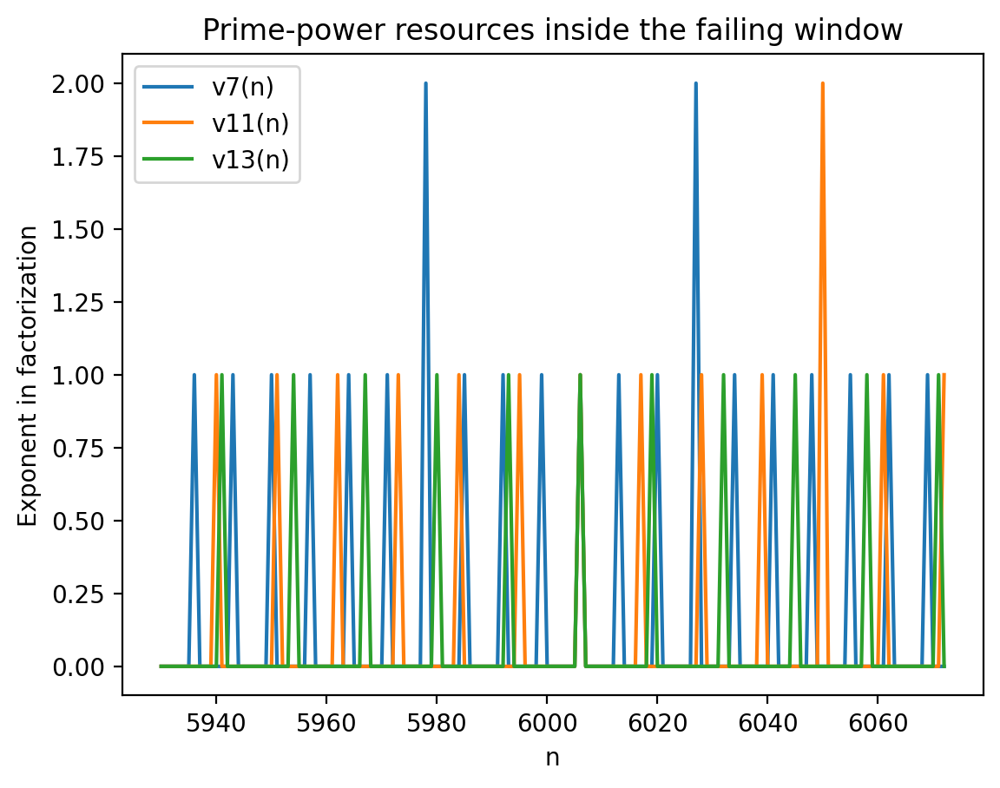
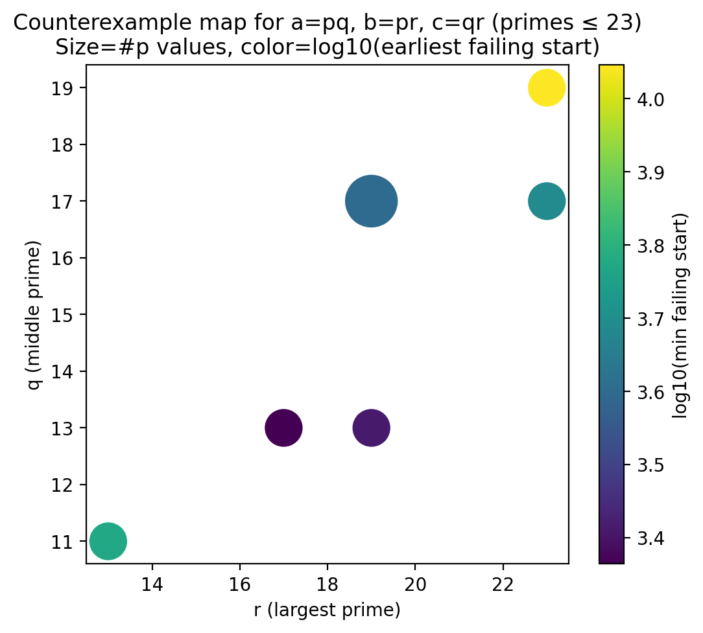

# ABC Product Divisibility Problem

## The Problem

**Original Claim:** Let a < b < c be distinct natural numbers. Must every block of c consecutive natural numbers contain three distinct numbers whose product is a multiple of abc?

**Answer:** **NO** - the statement is FALSE.

## Visualizations

### Modulus Overlay - The Failing Window

This chart shows "comb patterns" for multiples of key divisors inside the failing window [5930, 6072]:

Key observations:
- Only ONE number (6006) is divisible by both 77 (a) and 91 (b) and 143 (c)
- No multiples of 169 (13²) exist in the window
- The sparse overlap of prime multiples makes it impossible to find 3 distinct numbers whose product has enough prime factors

### Prime Exponent Resources

This chart shows the p-adic valuation (exponent of prime p in factorization) for each number in the failing window:

To get abc | xyz, we need v₇(xyz) ≥ 2, v₁₁(xyz) ≥ 2, and v₁₃(xyz) ≥ 2. The chart shows how "prime power resources" are distributed sparsely across the window.

### Counterexample Map for Prime Triples

This chart shows which prime triples (p, q, r) produce counterexamples:

- Each dot represents a prime triple where a=pq, b=pr, c=qr has a failing window
- Dot size = number of valid p values for that (q, r) pair
- Color = log₁₀ of the earliest failing window start position
- The pattern suggests infinitely many counterexamples exist

## Project Goals

### Phase 1: Prove FALSE by counterexample (simple)
- Use the known Lavrov counterexample: (a,b,c) = (77, 91, 143) = (7×11, 7×13, 11×13)
- The block [5930, 6072] has no valid triple
- This is a finite, checkable computation - easy to formalize in Lean

### Phase 2: Visualization & Exploration (Python)
- Port the ChatGPT code to run locally
- Generate the three key charts:
  1. Window feasibility (sliding window success/fail)
  2. Modulus overlay (comb patterns for multiples)
  3. Prime exponent resource map
- Explore the "chart of charts" idea for the (p,q,r) family

### Phase 3: Repaired Statements (provable TRUE cases)
Easy cases where the original statement IS true:

1. **All primes:** If a, b, c are distinct primes → always works
   - Proof: Any c consecutive integers contain multiples of each prime, collisions don't hurt

2. **Powers of single prime:** If a = p^x, b = p^y, c = p^z → always works
   - Proof: Counting multiples of p^k in a window of length p^z

3. **Pairwise coprime:** If gcd(a,b) = gcd(b,c) = gcd(a,c) = 1 → likely works
   - The "pick one multiple of each" strategy works without collision issues

### Phase 4: Inverse Statement (infinitely many counterexamples)

The **squared-primes construction:**

For primes p < q < r, define:
- a = pq
- b = pr
- c = qr
- abc = p²q²r²

Then finding a failing window requires:
1. No multiple of r² in the window (forces picking 2 multiples of r)
2. Only one number divisible by two of {p,q,r} (limits factor sharing)

**Open question:** Can we prove that for ALL primes p < q < r satisfying some condition C(p,q,r), there EXISTS a failing window?

If yes → infinitely many counterexamples with a uniform construction.

## Key Insight: Why 3 Numbers Matters

The problem requires exactly 3 numbers because you have 3 "buckets" to distribute prime factors. The counterexamples work by:
- Making abc require squared primes (p²q²r²)
- Engineering a window where you can't fit all the required exponents into 3 picks

## Files

- `PROBLEM.md` - Original problem statement and source links
- `images/` - Generated visualizations
- `ABCProductDivisibility.lean` - Problem definitions and main theorems
- `ABCCounterexample.lean` - Computational verification of counterexample

## Next Steps

1. [x] Set up Python environment and run the visualization code
2. [x] Create Lean project for formal proofs
3. [ ] Prove counterexample in Lean (finite computation)
4. [ ] Prove "all primes" case in Lean
5. [ ] Prove "powers of 2" case in Lean
6. [ ] Explore whether the infinite family can be formalized
